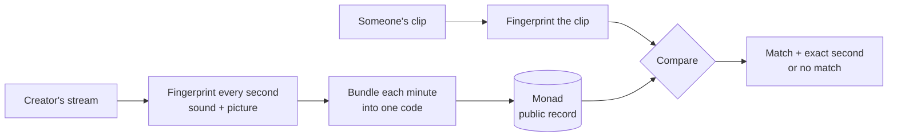

# Clipright

**Proof that a clip really came from the stream.**

Paste or drop a short video clip. Clipright tells you which stream it came from, down to the second, or tells you plainly that it does not match anything on record.

Built for Monad Metropolis, Track 04: Trust, Identity & AI Infrastructure.

---

## The problem

Most people never watch a livestream live. They see it as a 30-second clip on TikTok, Shorts, Reels or X, cut by someone else, cropped to vertical, with captions on top.

That creates two problems nobody can answer today:

1. **Is this clip real?** A clip can be edited, stitched together or partly AI-generated, and it still looks like it came from the stream. Viewers have no way to check.
2. **Who gets paid, and on whose word?** Clipping is now a paid job: streamers and brands pay editors per view to spread their moments. Whether a clip actually came from the right stream is checked by a person, by eye, inside one platform's private system.

Big rights holders have tools for this, such as YouTube's Content ID, but those are closed to most individual creators and only work inside one platform.

## What Clipright does

Think of it as a notary sitting next to the stream, stamping every minute.

| Step | What happens | In plain terms |
|---|---|---|
| **1. Record** | While a creator streams, Clipright listens to the sound and looks at the picture. | It takes notes on the stream. |
| **2. Stamp** | Every minute, it turns that minute into one short code and writes it on the Monad blockchain. | A public, timestamped receipt that cannot be changed later. |
| **3. Check** | Anyone drops a clip into Clipright. It compares the clip with the stamped minutes. | "Yes, this is from that stream, at this exact second" or "No match." |

The stream itself is never uploaded or stored onchain. Only the short codes are.

### What a result looks like

This is the shape of a result, not output from a finished build:

```
MATCH
Stream:   <creator>, recorded <date>
Clip:     21:14:02 to 21:14:31 (29 seconds)
Sound:    matched, aligned to the second
Picture:  matched on the vertical (9:16) crop
Receipt:  minute root <n>, Monad block <block>
```

or

```
NO MATCH
This clip does not line up with any stamped minute.
```

## How it works



**Sound first.** Clips almost always keep the stream's own audio. Clipright uses the same idea as song-recognition apps: it picks out distinctive points in the sound so it can find a short excerpt inside hours of audio and say exactly where it starts. Captions, cropping and re-compression do not change the sound.

**Picture second.** A vertical clip throws away about two thirds of a widescreen frame, which breaks normal image matching. So Clipright fingerprints the picture two ways in advance: the full frame and the centre vertical crop. A clip's picture matches only if one of those prepared versions lines up.

**One code per minute.** Each minute's fingerprints are combined into a single code (a Merkle root). Any one second can later be proven to be part of that minute without publishing the rest.

**Signed by the creator.** The creator signs each minute with a key made from their passkey (Face ID, Touch ID or a security key). Clipright's relayer submits the transaction and pays the gas, so that key never holds funds: it can sign stamps but cannot move money. The contract rejects any stamp the creator's key did not sign.

## Why Monad

- **Cheap enough to stamp every minute.** Monad charges for the gas limit you set, not what you use, so the relayer sets the limit to a fresh gas estimate plus 5%. On Monad testnet a stamp cost 0.0107 MON (104,982 gas at 102 gwei). A six-hour stream is 360 stamps, or about 3.85 MON, roughly $0.10 to $0.11 at MON prices of $0.027 to $0.029 (early October 2026). If network fees rise, it costs more.
- **Final in under a second.** Monad blocks are 300ms and final in about 600ms, so a minute's stamp is settled long before anyone could cut, caption and post a clip from it.
- **Public.** Anyone can check a clip against the record without asking Clipright, a platform, or the creator.

## What it does not do

These limits are part of the design, not fine print:

- **It is not a deepfake detector.** It proves whether footage lines up with what was stamped. It cannot judge a video that was never stamped.
- **Replaced audio weakens the match.** If a clip swaps the stream's sound for a trending song, only the picture check is left, and that only works when one of the prepared crops lines up.
- **It does not count views or catch bot views.** If view-count reporting is added, it will repeat what the platform reports, nothing more.
- **It only covers streams that were stamped.** Old footage, or streams by creators not using Clipright, cannot be checked.

## Who it is for

- **Creators** who want a public record of what they actually said and showed.
- **Viewers and journalists** checking whether a viral clip is genuine before sharing it.
- **Clippers** who want proof their clip is a faithful cut of the original.
- **Clipping platforms and campaigns** that today check sources by hand.

## Status

Built for Monad Metropolis (submissions close 13 October 2026). As of 2 October 2026:

- [x] **Matcher gate passes.** A synthetic two-minute stream and four clips (see below), run with `pnpm gate`.
- [x] **Contract** with 7 passing tests, including one proving the TypeScript engine and the Solidity contract build identical proofs.
- [x] **Check page.** Drop a file, get a match or a miss, then each matched minute is re-hashed in the browser and checked on Monad.
- [x] **Live studio.** Passkey key, open a stream, fingerprint camera or a shared tab, stamp each minute.
- [x] **Recorded files** can be stamped from the command line (`pnpm --filter @clipright/web stamp-file`).
- [x] **Mera passkey key**, tested end to end in Chrome with a virtual passkey that supports PRF. Not yet tried on a physical phone.
- [x] **Live on Monad testnet** at [`0x23388E372E0799c93Ab3f2846079c4dfBC8b111D`](https://testnet.monadscan.com/address/0x23388E372E0799c93Ab3f2846079c4dfBC8b111D), source [verified on Sourcify](https://sourcify.dev/server/repo-ui/10143/0x23388E372E0799c93Ab3f2846079c4dfBC8b111D). The four test clips pass against it in Chrome.
- [x] **Envio HyperSync** reads the registry's full event history for the streams list and the "stamped first" ordering. Monad's public RPC limits log queries to 100 blocks (about 30 seconds of history), so without it the app can only see recent streams.
- [ ] **Hosting and demo video.**

### The test clips

| Clip | What was done to it | Result |
|---|---|---|
| A | 9:16 centre crop, burned-in captions, AAC re-encode | Matched at 47.297s (true start 47.3s) |
| B | Same pictures, soundtrack replaced | Sound missed; pictures matched at 47.25s |
| C | Unrelated video | No match |
| D | Landscape, scaled to 480p, low bitrate | Matched at 88.602s (true start 88.6s) |

The same four clips give the same results in Chrome through the Check page. Matching pictures were 14 to 40 bits apart out of 256, and the unrelated clip was never closer than 90.

All demo footage is recorded by us. Clipright does not capture other people's streams.

## Run it

Needs Node 22 or newer and pnpm.

```bash
pnpm install
pnpm gate                                   # matcher gate on a synthetic stream
pnpm test                                   # engine and contract tests

# local devnet
cd packages/contracts && npx hardhat node   # terminal 1
pnpm deploy:local                           # terminal 2, from packages/contracts
cd apps/web && NEXT_PUBLIC_CHAIN_ID=31337 pnpm dev
```

The web app reads `RELAYER_KEY` (pays gas for stamps) and, optionally, `ENVIO_HYPERSYNC_KEY` from `.env` at the repo root (see `.env.example`). The registry address is picked up from `packages/contracts/deployments/<chainId>.json`.

## How the code is laid out

- `packages/engine`: fingerprinting, matching and Merkle proofs in plain TypeScript. The same code runs in the browser and in Node.
- `packages/contracts`: `StampRegistry.sol`, one stamp per stream minute, signed by the stream's key and relayed by anyone.
- `apps/web`: Next.js app with the check page, live studio, stream records and the relayer API.

## Built with

- [Monad](https://monad.xyz): the public record of minute stamps
- [Mera](https://github.com/category-labs/mera): the stamping key, derived from a passkey with Clipright's own PRF salt
- [Envio HyperSync](https://docs.envio.dev/docs/HyperSync/overview): stream history beyond the public RPC's 100-block log limit
- Sound fingerprinting in the style of Shazam and [audfprint](https://github.com/dpwe/audfprint), and a picture hash in the style of [PDQ](https://github.com/facebook/ThreatExchange), both written from scratch in TypeScript

## The mark

Two brackets closing on one bar: a clip locking onto the exact second it came from.

## Glossary

- **Fingerprint:** a compact summary of a second of sound or picture that stays the same after cropping, captions or compression, within limits.
- **Merkle root:** one short code standing for a whole minute of fingerprints. Any single second can be proven to belong to it.
- **Passkey:** the Face ID, Touch ID or security-key login built into phones and laptops.
