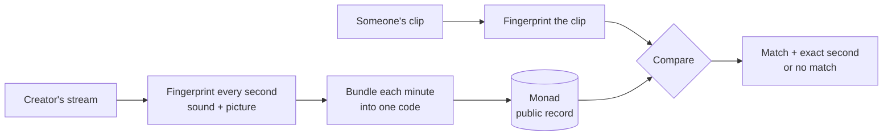

# Clipright

**Proof that a clip really came from the stream.**

Paste or drop a short video clip. Clipright tells you which stream it came from, down to the second, or tells you plainly that it does not match anything on record.

Built for Monad Metropolis, Track 04: Trust, Identity & AI Infrastructure.

---

## The problem

Most people never watch a livestream live. They see it as a 30-second clip on TikTok, Shorts, Reels or X, cut by someone else, cropped to vertical, with captions on top.

That creates two problems nobody can answer today:

1. **Is this clip real?** A clip can be edited, stitched together or partly AI-generated, and it still looks like it came from the stream. Viewers have no way to check.
2. **Who gets paid, and on whose word?** Clipping is now a paid job: streamers and brands pay editors per view to spread their moments. Whether a clip actually came from the right stream is checked by a person, by eye, inside one platform's private system.

Big rights holders have tools for this, such as YouTube's Content ID, but those are closed to most individual creators and only work inside one platform.

## What Clipright does

Think of it as a notary sitting next to the stream, stamping every minute.

| Step | What happens | In plain terms |
|---|---|---|
| **1. Record** | While a creator streams, Clipright listens to the sound and looks at the picture. | It takes notes on the stream. |
| **2. Stamp** | Every minute, it turns that minute into one short code and writes it on the Monad blockchain. | A public, timestamped receipt that cannot be changed later. |
| **3. Check** | Anyone drops a clip into Clipright. It compares the clip with the stamped minutes. | "Yes, this is from that stream, at this exact second" or "No match." |

The stream itself is never uploaded or stored onchain. Only the short codes are.

### What a result looks like

This is the shape of a result, not output from a finished build:

```
MATCH
Stream:   <creator>, recorded <date>
Clip:     21:14:02 to 21:14:31 (29 seconds)
Sound:    matched, aligned to the second
Picture:  matched on the vertical (9:16) crop
Receipt:  minute root <n>, Monad block <block>
```

or

```
NO MATCH
This clip does not line up with any stamped minute.
```

## How it works



**Sound first.** Clips almost always keep the stream's own audio. Clipright uses the same idea as song-recognition apps: it picks out distinctive points in the sound so it can find a short excerpt inside hours of audio and say exactly where it starts. Captions, cropping and re-compression do not change the sound.

**Picture second.** A vertical clip throws away about two thirds of a widescreen frame, which breaks normal image matching. So Clipright fingerprints the picture several ways in advance: the full frame, the centre vertical crop, and the facecam area. A clip's picture matches only if one of those prepared versions lines up.

**One code per minute.** Each minute's fingerprints are combined into a single code (a Merkle root). Any one second can later be proven to be part of that minute without publishing the rest.

**Signed by the creator.** The creator signs each minute with a key made from their passkey (Face ID, Touch ID or a security key). That key can sign stamps but cannot move money.

## Why Monad

- **Cheap enough to stamp every minute.** Monad charges for the gas limit you set, not what you use, so we keep the limit tight. At the documented minimum base fee, a 100,000-gas stamp costs 0.01 MON. A six-hour stream is 360 stamps, or 3.6 MON, roughly $0.10 at MON prices of $0.027 to $0.029 (early October 2026). If network fees rise above the minimum, it costs more.
- **Final in under a second.** Monad blocks are 300ms and final in about 600ms, so a minute's stamp is settled long before anyone could cut, caption and post a clip from it.
- **Public.** Anyone can check a clip against the record without asking Clipright, a platform, or the creator.

## What it does not do

These limits are part of the design, not fine print:

- **It is not a deepfake detector.** It proves whether footage lines up with what was stamped. It cannot judge a video that was never stamped.
- **Replaced audio weakens the match.** If a clip swaps the stream's sound for a trending song, only the picture check is left, and that only works when one of the prepared crops lines up.
- **It does not count views or catch bot views.** If view-count reporting is added, it will repeat what the platform reports, nothing more.
- **It only covers streams that were stamped.** Old footage, or streams by creators not using Clipright, cannot be checked.

## Who it is for

- **Creators** who want a public record of what they actually said and showed.
- **Viewers and journalists** checking whether a viral clip is genuine before sharing it.
- **Clippers** who want proof their clip is a faithful cut of the original.
- **Clipping platforms and campaigns** that today check sources by hand.

## Status

Work in progress for Monad Metropolis (submissions close 13 October 2026).

- [ ] Day 1 gate: record a two-minute test stream, export a 15-second vertical crop, and confirm the sound match returns the correct second
- [ ] Minute-stamp contract on Monad testnet
- [ ] Recorder that fingerprints and stamps a live recording
- [ ] Check page: drop a file, get a match or a miss
- [ ] Indexer for stamps (Envio)
- [ ] Passkey signing key (Mera), if passkey support works on the demo device
- [ ] Demo video with the four test clips below

**The demo test, in this order:**

1. Same sound, vertical crop, captions, re-encoded: must return the right second.
2. Same picture, sound replaced: sound must miss; picture score shown either way.
3. An unrelated video: must miss.
4. A judge crops the stamped recording on their own machine and drops it in.

All demo footage is recorded by us. Clipright does not capture other people's streams.

## Built with

- [Monad](https://monad.xyz): public record of minute stamps
- [audfprint](https://github.com/dpwe/audfprint): sound fingerprinting
- [PDQ](https://github.com/facebook/ThreatExchange): picture fingerprinting
- [Envio](https://envio.dev): indexing stamps for the check page
- [Mera](https://github.com/category-labs/mera): passkey-derived signing key (planned)

## Glossary

- **Fingerprint:** a compact summary of a second of sound or picture that stays the same after cropping, captions or compression, within limits.
- **Merkle root:** one short code standing for a whole minute of fingerprints. Any single second can be proven to belong to it.
- **Passkey:** the Face ID, Touch ID or security-key login built into phones and laptops.
